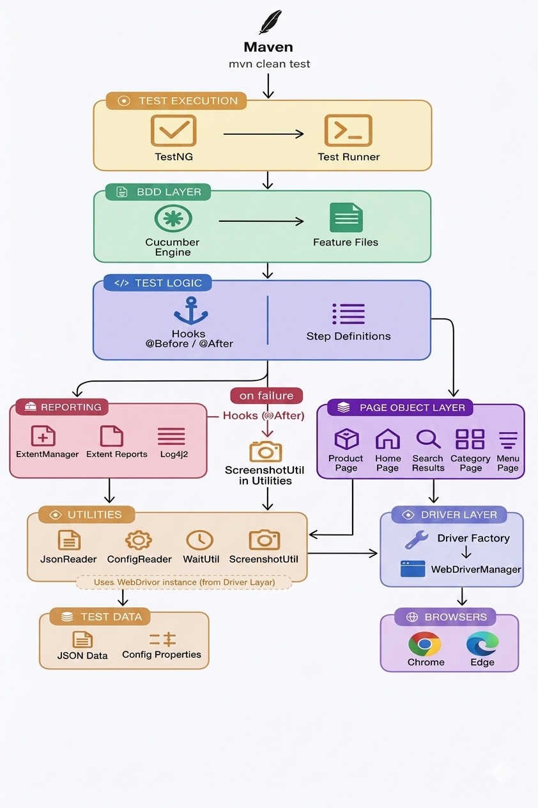
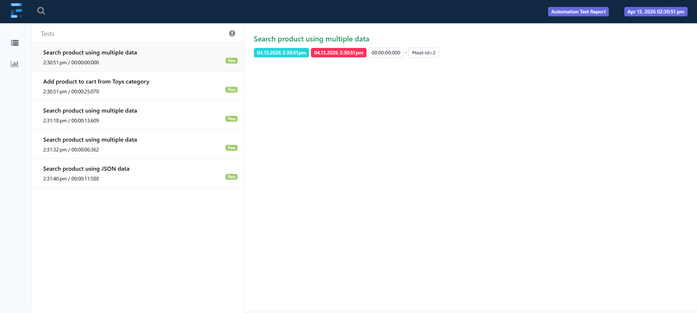
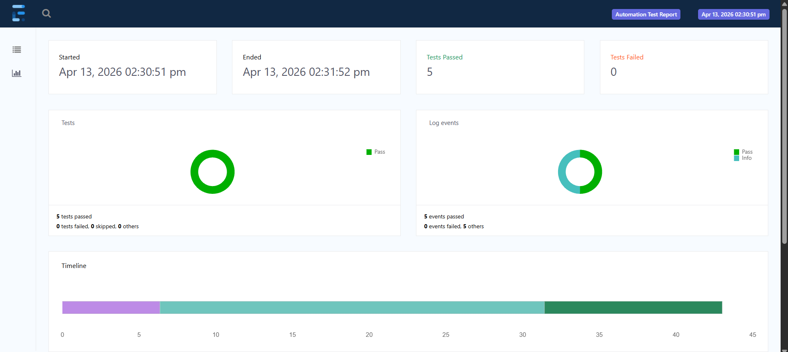
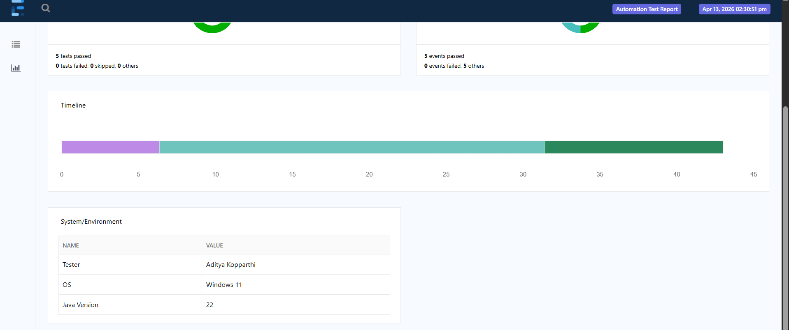

# Precision UI BDD Automation Framework

## Overview
This project, titled **“Precision UI BDD Automation Project”**, is a Hybrid Test Automation Framework designed using Behavior-Driven Development (BDD) to automate web application testing.

### Tech Stack
- Java
- Selenium WebDriver
- Cucumber (BDD)
- TestNG
- Maven
- Log4j2
- Extent Reports

---

## Objectives
- Implement Page Object Model (POM)
- Use BDD with Cucumber (Gherkin syntax)
- Support Data-Driven Testing (JSON + Parameterization)
- Enable Cross-Browser Execution
- Generate Reports and Logs
- Support Parallel Execution

---

## Framework Architecture

```
Test Runner (TestNG)
        ↓
Feature Files (BDD)
        ↓
Cucumber Engine
        ↓
Hooks (@Before / @After)
        ↓
Step Definitions
        ↓
Page Object Model (POM)
        ↓
DriverFactory
        ↓
Browser
        ↓
Hooks (Teardown)

----------------------------------------
Utilities Layer
(Config | JSON | Wait | Screenshot)
----------------------------------------

Reporting Layer
(Extent Reports + Log4j2)
```

---
## Framework Architecture (Diagram)



## Key Features
- Hybrid Framework (POM + BDD + Data-Driven)
- BDD using Cucumber
- Data-Driven Testing using JSON
- Parameterized Testing using Scenario Outline (msearch.feature)
- Parallel Execution using TestNG
- Cross-Browser Support (Chrome, Edge)
- Thread-safe DriverFactory
- Hooks-based lifecycle management
- Screenshot capture on failure
- Extent Reports + Log4j2

---

## Test Scenarios

### Search Product (JSON Data)
- Read product from JSON
- Enter product in search bar
- Click suggestion
- Validate results

### Add to Cart
- Navigate to Toys category
- Select product
- Add to cart
- Validate subtotal and cart count

### Parameterized Search (Scenario Outline)

```
Scenario Outline: Search product using multiple data
  Given user opens Amazon homepage
  When user enters "<product>" in search bar
  And user clicks on first suggestion
  Then results page should be displayed
  And results should be relevant to entered product

Examples:
  | product  |
  | iPhone   |
  | Samsung  |
  | Laptop   |
```

---

## Data-Driven Testing

### JSON Example

```
{
  "product": "iPhone"
}
```

---

## Project Structure

```
|── logs
|   └── automation.log

|── src
│   ├── main/java
│   │   ├── factory
│   │   ├── pages
│   │   └── utils
│   │
│   ├── test/java
│   │   ├── hooks
│   │   ├── runners
│   │   └── stepdefinitions
│   │
│   ├── test/resources
│       ├── features
│       │   ├── search.feature
│       │   ├── add_to_cart.feature
│       │   └── msearch.feature
│       └── testdata
│           └── searchData.json

|── test-output
|── screenshots
|── pom.xml
|── testng.xml
|── README.md
```

---

## Utilities

| Utility | Description |
|--------|------------|
| ConfigReader | Reads configuration |
| JsonReader | Reads JSON data |
| WaitUtil | Synchronization |
| ScreenshotUtil | Captures screenshots |
| ExtentManager | Reporting |

---

## Cross Browser Support

```
browser=chrome
```

---

## Parallel Execution

```
@DataProvider(parallel = true)
public Object[][] scenarios() {
    return super.scenarios();
}
```

---

## Reporting and Logging
- Extent Reports
- Log4j2
- Screenshot on failure

---

## Execution

```
mvn clean test
```

---

## Results
- Successful execution of all scenarios
- JSON and parameterized testing validated
- Cross-browser execution achieved
- Parallel execution reduced runtime
- Screenshots captured on failure
- Detailed reports generated
---
## Test Reports

<p align="center">
  
  
  
</p>

## Conclusion
This framework follows a hybrid approach (POM + BDD + Data-Driven) ensuring scalability, maintainability, and efficient automation aligned with industry standards.

---

## Team Contribution

### Aditya Kopparthi
- Designed and implemented the Hybrid Automation Framework (POM + BDD + Data-Driven)
- Integrated Cucumber with TestNG for scalable execution
- Implemented parallel execution using TestNG DataProvider
- Developed Page Object Model for modular automation
- Implemented data-driven testing using JSON and Scenario Outline
- Integrated Extent Reports with screenshot capture on failure
- Built utility layer (ConfigReader, ScreenshotUtil, WaitUtil, ExtentManager)
- Implemented logging using Log4j
- Configured Maven and Surefire Plugin for execution
- Implemented cross-browser testing using config.properties
- Designed overall framework architecture

### Akula Kalyan Sai Ram
- Developed BDD feature files for search and add-to-cart scenarios
- Implemented step definitions mapping Gherkin steps to code
- Worked on assertions and validation logic
- Assisted in debugging and fixing test failures
- Maintained test data and ensured smooth execution
- Contributed to Git repository management
- Assisted in implementing reusable page methods
- Helped validate execution reports and results

---

## Future Enhancements
- CI/CD Integration (Jenkins / GitHub Actions)
- Selenium Grid / Cloud Execution
- Docker Integration
- Advanced Data-Driven Testing
- API Testing Integration